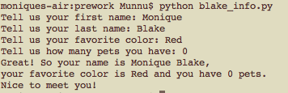

# pre-work
### Week 1: blake_info.py
-----------

This program is a simple program that implements raw_input and string formatting. The user gets asked a series of questions and then a formatted sentence is generated based on their response. There is also a try-except-else to catch whether the user types in a non-number for the number of pets that they have.

Output screenshot: 

